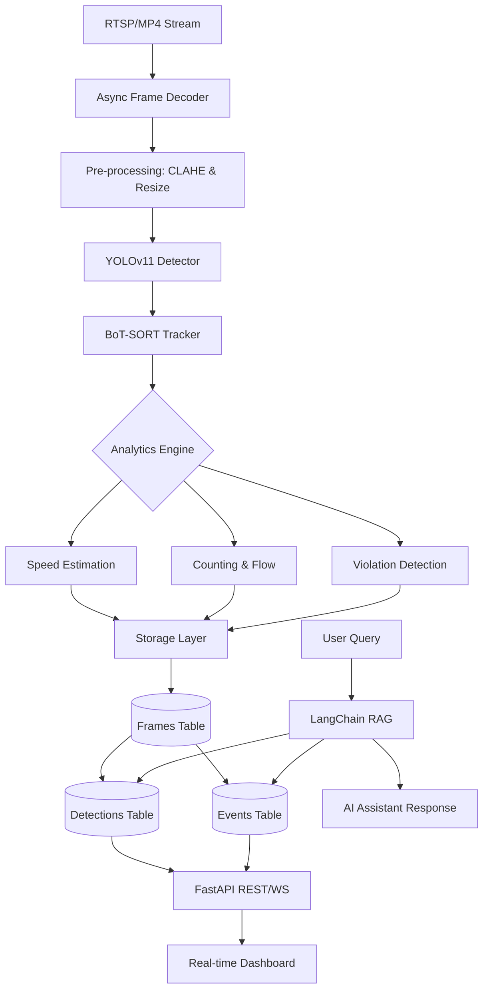

# ITMS System Architecture — Detailed Specification

## 1. Tổng quan Hệ thống
Hệ thống Quản lý Giao thông Thông minh (ITMS) được thiết kế theo kiến trúc **Distributed Vision Pipeline**, tập trung vào việc xử lý luồng video thời gian thực với độ trễ thấp (low-latency) và phân tích dữ liệu quy mô lớn sử dụng TimescaleDB.

## 2. Kiến trúc Pipeline (End-to-End)

### 2.1 Pre-processing Layer
- **CLAHE (Contrast Limited Adaptive Histogram Equalization)**: Tối ưu độ tương phản cho từng vùng nhỏ (tiles), giúp Detector hoạt động ổn định trong điều kiện thiếu sáng hoặc sương mù mà không làm khuếch đại nhiễu quá mức.
- **Batching**: Grouping frames để tối ưu hóa throughput của CUDA cores.

### 2.2 AI Core Layer
- **Detector (YOLOv11)**: Sử dụng TensorRT engine để đạt FPS cao nhất trên phần cứng NVIDIA.
- **Tracker (BoT-SORT)**: Kết hợp thông tin chuyển động (Kalman Filter) và đặc trưng ngoại quan (Re-ID) để duy trì ID đối tượng ổn định ngay cả khi bị che khuất (occlusion).

### 2.3 Analytics Engine (Logic tính toán)
- **Vận tốc (Velocity)**: 
    - Áp dụng **Perspective Transform** để chuyển đổi tọa độ pixel (image space) sang tọa độ mét (world space) dựa trên các điểm chuẩn.
    - Công thức: $v = \frac{d(P_{t1}, P_{t2})}{\Delta t}$ (với $d$ là khoảng cách Euclid trong không gian thực).
- **Ùn tắc (Congestion)**: 
    - Định nghĩa vùng **ROI (Region of Interest)**.
    - Monitor vector chuyển động của từng ID. Nếu số lượng ID có vận tốc $\approx 0$ vượt ngưỡng mật độ trong $> 60s$, hệ thống kích hoạt cảnh báo ùn tắc.

## 3. Database Schema (PostgreSQL + TimescaleDB)

Hệ thống sử dụng cấu trúc quan hệ chặt chẽ để quản lý luồng dữ liệu từ frame hình ảnh đến các kết quả phân tích AI.

### 3.1 Bảng `cameras` (Metadata)
Quản lý thông tin định danh và vị trí lắp đặt của camera.
| Cột | Kiểu dữ liệu | Mô tả |
| :--- | :--- | :--- |
| `camera_id` | `VARCHAR` (PK) | Mã định danh duy nhất của camera |
| `location` | `POINT` | Tọa độ địa lý lắp đặt |
| `metadata` | `JSONB` | Thông số kỹ thuật (fps, resolution, config...) |

### 3.2 Bảng `frames` (Hypertable)
Lưu trữ thông tin về từng frame hình ảnh đã xử lý. Đây là bảng chính để phân vùng thời gian (partitioning).
| Cột | Kiểu dữ liệu | Mô tả |
| :--- | :--- | :--- |
| `frame_uuid` | `UUID` (PK) | ID duy nhất của frame |
| `frame_id` | `BIGINT` | ID frame từ luồng xử lý |
| `timestamp` | `TIMESTAMPTZ` | Thời gian thực ghi nhận (đến ms) |
| `camera_id` | `VARCHAR` | FK tham chiếu tới bảng `cameras` |

### 3.3 Bảng `detections` (Hypertable)
Lưu trữ kết quả nhận diện đối tượng (YOLO + Tracker) cho mỗi frame.
| Cột | Kiểu dữ liệu | Mô tả |
| :--- | :--- | :--- |
| `detection_id` | `BIGSERIAL` (PK) | ID định danh nhận diện |
| `frame_uuid` | `UUID` | FK tham chiếu tới bảng `frames` |
| `track_id` | `INT` | ID theo vết của đối tượng |
| `class` | `VARCHAR` | Loại phương tiện (car, motorbike, bus...) |
| `confidence` | `FLOAT` | Độ tin cậy của detection |
| `bbox` | `INT[]` | Tọa độ khung hình [x1, y1, x2, y2] |
| `bottom_center` | `POINT` | Tọa độ điểm chân không gian (dùng cho Speed/Distance) |

### 3.4 Bảng `events`
Lưu trữ các sự kiện giao thông và hành vi vi phạm.
| Cột | Kiểu dữ liệu | Mô tả |
| :--- | :--- | :--- |
| `event_id` | `BIGSERIAL` (PK) | ID định danh sự kiện |
| `frame_uuid` | `UUID` | FK tham chiếu tới bảng `frames` |
| `event_type` | `VARCHAR` | Loại sự kiện (wrong_way, illegal_parking...) |
| `track_id` | `INT` | ID của đối tượng liên quan |
| `description` | `TEXT` | Mô tả chi tiết sự kiện |

## 4. Interaction & RAG Layer
- **Chatbot RAG**: Sử dụng LangChain để kết nối dữ liệu từ PostgreSQL với LLM (`claude-sonnet-4-20250514`).
- **Query Flow**: User hỏi → LLM chuyển thành SQL (ví dụ: "Thống kê lượng xe qua cầu Chương Dương lúc 8h sáng") → Thực thi trên TimescaleDB → LLM tổng hợp câu trả lời theo văn phong tự nhiên.

## 5. Ràng buộc Hiệu năng
- **Latency**: Tổng thời gian từ Frame Ingestion đến Metadata Storage phải $< 200ms$.
- **Precision**: Độ chính xác Speed Estimation sai số không quá $\pm 5\%$.
- **Storage**: Tự động nén (Compression) dữ liệu `traffic_metrics` cũ hơn 7 ngày bằng chính sách của TimescaleDB.
